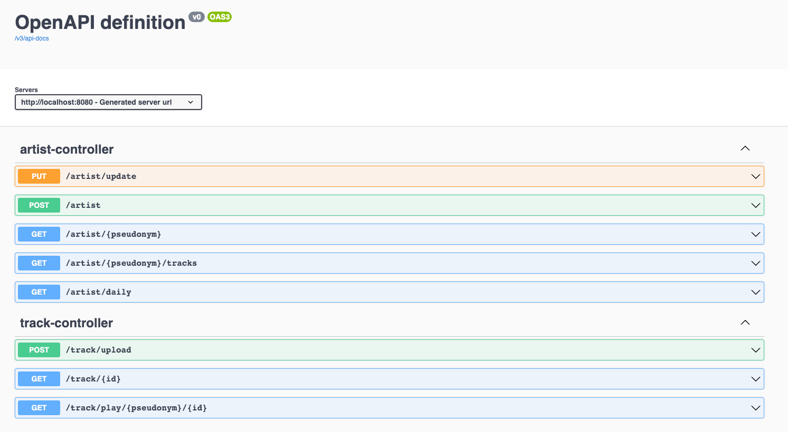
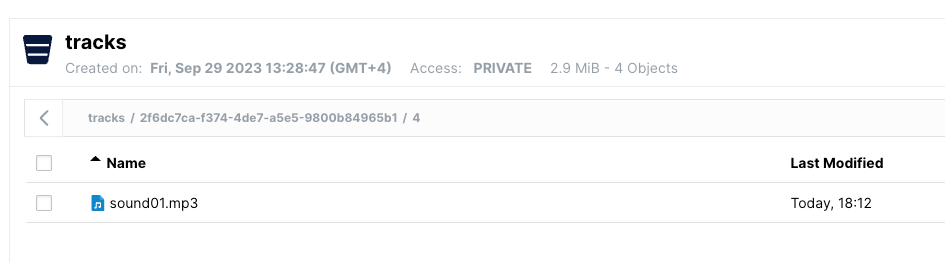
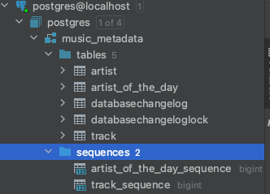

# music-metadata

Use swagger for more information about API:

Spring Boot 3 , Java 17

http://localhost:8080/swagger-ui/index.html#/

This service provides to create artists and download/upload their tracks:
For storing files is used minIO:

For storing entities is used Postgres:

How to run and check service work:

1. Execute docker-compose.yml
2. Run music metadata app with profile dev
3. Use this curls:

**To get daily artist:**

curl --request GET \
--url 'http://localhost:8080/artist/daily?zonedDateTime=2023-09-30T10%3A15%3A30%2B08%3A00' \
--header 'User-Agent: insomnia/8.1.0'

**To play track:**

curl --request GET \
--url http://localhost:8080/track/play/polkins/4 \
--header 'User-Agent: insomnia/8.1.0'

**To get artist:**

curl --request GET \
--url http://localhost:8080/artist/polkins \
--header 'User-Agent: insomnia/8.1.0'

**To get all tracks:**

curl --request GET \
--url 'http://localhost:8080/artist/polkins/tracks?pseudonym=polkins' \
--header 'User-Agent: insomnia/8.1.0'

**To update artist`s data:**

curl --request PUT \
--url http://localhost:8080/artist/update \
--header 'Content-Type: application/json' \
--header 'User-Agent: insomnia/8.1.0' \
--data '{
"uuid": "2f6dc7ca-f374-4de7-a5e5-9800b84965b1",
"name": "Palina",
"surname": "Spiryaeva",
"pseudonym": "polkins",
"email": "markinapln@gmail.com"
}'

**To upload track:**

curl --request POST \
--url http://localhost:8080/track/upload \
--header 'Content-Type: multipart/form-data' \
--header 'User-Agent: insomnia/8.1.0' \
--form file=@/Users/polkins/Desktop/sound01.mp3 \
--form 'uploadDTO={
"pseudonym": "polkins",
"genre": "techno"
}'

**To create artist:**

curl --request POST \
--url http://localhost:8080/artist \
--header 'Content-Type: application/json' \
--header 'User-Agent: insomnia/8.1.0' \
--data '{
"uuid": null,
"name": "Polina",
"surname": "Spiryaeva",
"pseudonym": "polkins",
"email": "markinapln@gmail.com"
}'

