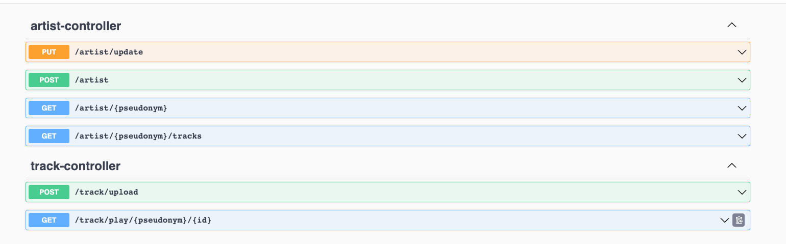

# music-metadata

Use swagger for more information about API:

Spring Boot 3 , Java 17

http://localhost:8080/swagger-ui/index.html#/

This service provides to create artists and download/upload their tracks:
For storing files is used minIO:

For storing entities is used Postgres:

How to run and check service work:

1. Execute docker-compose.yml
2. Run music metadata app with profile dev
3. Use this curls:

